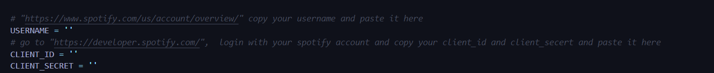
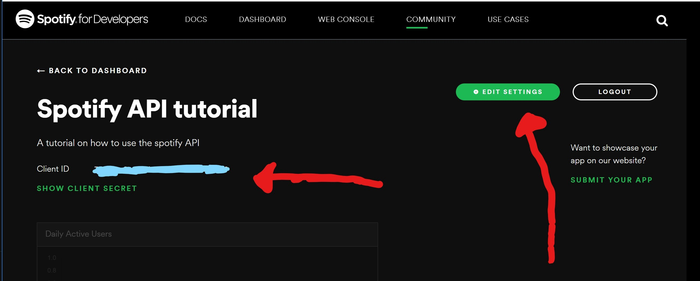
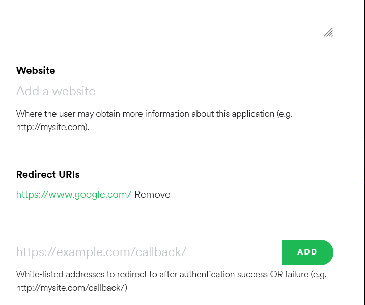
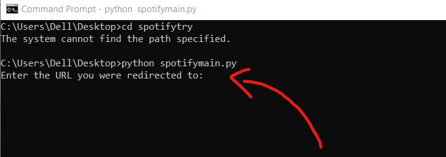

# Spotify-automate

## Create playlist for your local music files and listen on every device

#### This is a personal project

## Why I built this program?

#### 1. I wanted to list my local songs on spotify app and listen to them on all of my devices (Phone, TV, Car), but to do that I had to copy the local files onto all of my devices which is time/space consuming and a tedious task.

#### 2. If in case of you have a data loss, you might loose all your local files and your fav songs, so its better to store it or create playlist on spotify and listen everywhere.

#### 3. To do the above mentioned tasks, I had to manually **search** and **add** all of my songs to my spotify playlist one after one which is a hassle :unamused:

#### To solve the above problems I bulit **_Spotify-automate_**.

## How is my program helpful?

#### 1. **_Spotify-automate_** reads all your local music files.

#### 2. Searches all your local songs from the spotify database using spotify API references and adds them to a playlist.

#### 3. So this enables you to listen to all your local songs on any of your devices without having to have the local files stored on other devices :smile:

##### Spotify has a feature called "Local files" where you can listen to your local songs, but you cannot listen to them on other devices as you need to have a copy of all those songs stored onto your devices(TV or Car), which is not possible. "Local files" feature is not available for every device and gadgets.

## How to run **_Spotify-automate_**?

### 1. Before running the python script you have to get to your client_id and client_secret from Spotify developers website.

[Link to the spotify developers website](https://developer.spotify.com/)

### 2. Open "spotifymain.py" and paste your credentials.

### 3. Go to spotify developers website, go to edit settings and add https://www.google.com/ as the redirect URL.

### 3. Copy and paste destination path of your music folder.

### 4. Install requirements in terminal.

How to install requirements

  <h3>pip install -r requirements.txt<h3>

### 5. Run the python script.

### 6. After running the program on cmd, it will redirect you to google.com for your permission, grant the permission, copy the URL and paste the URL on cmd.

### 7. Follow the instructions.

### 8. Enjoy your fav songs everywhere :scream_cat:

###### If few songs are not added then the mp3 file dosen't contain proper title, album or artist name.

https://user-images.githubusercontent.com/60339025/138585994-c9ea4317-d263-4577-9de9-58056fe079d7.mp4
